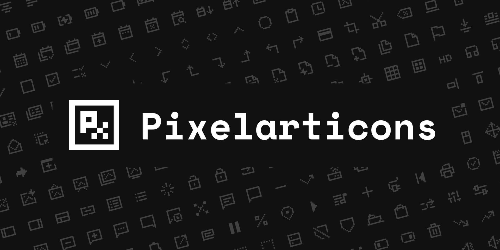

# Pixelarticons


486 careful handmade pixel art icons based on a 24x24 grid and `currentColor` fills. All icons were made individually using rectangles to recreate a non-anti-aliased look. It makes use of subtle padding for each icon. It is recommended to use the icons with a width and height of 24px, 48px, 72px, 96px because on all scales outside of 24px the icons will appear blurry.

## How to get the icons

- From the [🌐 Pixelarticons website](https://pixelarticons.com "Pixelarticons - Website")
- Duplicate the [🎨 Pixelarticons Figma file](https://www.figma.com/community/file/952542622393317653/Pixelarticons)
- Use them directly in your code: 👇
 
## Gettings Started

### Install via package manager
```bash
npm i pixelarticons@latest
```

### Use directly via unpkg (replace "file")
```html

```

## Generate webfont

Thanks to @Cerallin you can easily create all webfont files with a simple npm command which puts all icons in various webfont formats into a `./fonts/` folder.

```bash
npm run font
```


## Current tasks

- [x] Figma file with components
- [x] Updating SVG source code for all icons
- [x] Convert all rectangles into SVG-paths
- [x] Make public Figma-file with icon library
- [x] Add a new filled set
- [ ] Add a new 32x32 set

## Where else to find?

- [Website](https://www.pixelarticons.com "Pixelarticons - Website")
- [Instagram](https://www.instagram.com/pixelarticons/ "Pixelarticons - Instagram")
- [NPM](https://www.npmjs.com/package/pixelarticons "Pixelarticons - Npm")
